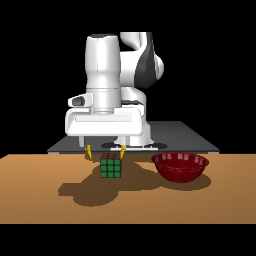
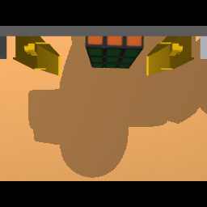
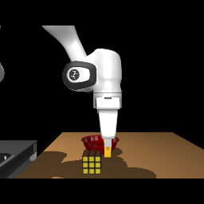

# Controlled MuJoCo ablations: cube into bowl

Task: **Put the cube in the bowl**. Model: **gemini-3.8-flash**, Google API.

**Completed: 18 full episodes, 24 paired decision calls, and a seven-position
mechanics experiment.** The cube was physically placed in the bowl in **15/18**
episodes across the different configurations. That pooled count is descriptive,
not a reliability estimate or a comparison between conditions.

| Isolated change | Control successes | Changed-condition successes | Conclusion |
| --- | ---: | ---: | --- |
| Append one fixed side image | 2/3 | 2/3 | No observed success improvement |
| Add a camera-description paragraph, with three images in both arms | 3/3 | 2/3 | Better initial XY alignment in that sample, no success improvement |
| Amend only the visual GRASP condition, with three images and the same description | 3/3 | 3/3 | No success improvement; more drops in the changed condition |

**The system can complete this task, but none of these changes demonstrates a
reliable fix for grasp centering.** All variants remain optional; no unsuccessful
hypothesis is promoted into the default policy. Earlier development runs are
excluded from these comparisons. The measured failure mechanism and next tests
are summarized at the end of this report.

[Combined machine-readable summary](assets/mujoco/summary_20260915.json).
Across all episodes and probes, **1,081 HTTP attempts** succeeded and reported
the requested model; recorded payloads and image hashes passed their audits.

The summary and example request below are included in Git under
`docs/assets/mujoco/`, with [file hashes](assets/mujoco/manifest.json). Links into
`rollouts/` refer to local experiment artifacts; full traces, videos, and source
snapshots are ignored by Git. Downloaded/generated assets under `models/` are
also local. Use the setup and new-study commands below to generate fresh runs
in another checkout.

## What is, and is not, a reproduction

This is a MuJoCo adaptation of the public Show-Harness code, **not an unchanged
reproduction of a paper demo**. The following distinctions matter when interpreting
successes and failures:

| Component | Public source | Current adaptation |
| --- | --- | --- |
| Task and scene | RoboLab `RubiksCubeTask`, cube/bowl/table assets and authored layout | Converted from the pinned source USD; same instruction, source meshes, textures, transforms and masses |
| Robot | Franka with this repo's yellow fingers and brackets | Original finger geometry/home pose; Menagerie Panda arm model |
| Simulator | Isaac Lab / PhysX / RTX | MuJoCo 3.13.0; different contact solver, collision cooking and rendering |
| Public RoboLab policy entry point | Fine-tuned action policy (`run_robolab_mvtoken.py`) | Public zero-shot planner/controller and plugins (`make_runner` / `RealEpisodeRunner`) |
| Public zero-shot default model | `gemini-3.1-pro` in `robot_franka.yaml` | User-selected `gemini-3.8-flash` through Google's API |
| Original two camera inputs | RoboLab Franka front/wrist camera constants and image transforms | Preserved; the treatment adds one separate fixed side image |
| Motion execution | Physical Franka or Isaac relative IK, depending on entry point | Same semantic actions executed by MuJoCo IK and position servos; measured 2 cm moves are calibrated |
| Episode budget | Different budgets in the real and RoboLab configurations | 150 decisions for every trial in this study |

The public real-robot session also defaults controller images to 256 × 256.
Its planner can use optional higher-resolution observations; this adapter exposes
only the prepared 256 × 256 front/wrist inputs. Thus controller resolution is
not unique to the port, while planner input detail can differ from a real setup.

The public configuration also names optional lab overlays that are absent from
this checkout. We have not compared against an Isaac run or established the
exact private settings used for a particular published demo. A successful demo
does not settle the reliability of this adapted configuration.

The source checkout is `137d5718c3b7af0150764d8f9beeb252c9f2794a`;
RoboLab is pinned to `ad45d4f974725d020f82c2b0d77d78533aeba2b3` and
Menagerie to `8161bba264d7fa7c99ca301e91e7fb44737676ad`.
See [conversion details](mujoco.md) for the remaining physics/rendering differences.

## Experiment 1: transmit one additional camera image

Hypothesis: a fixed side view exposes the forward/backward error and grasp height
that are difficult to distinguish in the wrist image, improving grasping and
placement without changing the VLM's action policy.

| Condition | Images in every API request | Repetitions |
| --- | --- | ---: |
| A — baseline | Original front + wrist | 3 |
| B — side camera | Same front + wrist, followed by one unannotated side image | 3 |

The order is **A, B, B, A, A, B**, resetting to the same authored scene each time.
All requests include planning, normal controller decisions, and retries. Both
conditions render the same three cameras and use identical passive logging;
only transmission of the third image changes. The side camera is fixed at
`[0.45, -0.65, 0.25]` m, looking toward the fixed workspace point
`[0.45, 0.0, 0.22]` m. It does not track an object. Its input is a 256 × 256 RGB
image, prepared from a 640 × 480 render with a 45-degree vertical field of view.

Prompt templates, camera-use instructions, model parameters, action increments,
plugins, initial state, physics, assets, scoring, and the 150-step budget remain
unchanged. No label or explanation is added for the third image: this experiment
tests the image alone. Any later change to camera instructions is a separate factor.

The VLM receives raw RGB and the existing robot proprioception/action feedback.
No target coordinates, markers, object poses, simulator success feedback, or
scripted task controller enter its requests. State vectors are recorded in a
separate file for diagnosis **after** each episode.

### Measurements and audit trail

The primary outcome is independent physical success using the converted source
task predicate: cube in the bowl, supported by contact, and detached from the
gripper. Runtime errors count as failures; the VLM's own success declaration is
recorded separately. Secondary measurements include steps, empty/lost grasps,
API calls, elapsed time, tokens, and post-run jaw-axis/cube XY error at each grasp.

Three repetitions per condition are an exploratory screen. The hosted model is
not seed-controlled, despite temperature zero, and the initial layout is not
randomized. This study cannot establish real-robot or general-scene reliability.

All source/config and asset hashes are frozen and checked before each trial.
The study retains failed runs, exact per-request PNGs and prompt text, responses,
inference parameters, HTTP statuses, model IDs, and physics state records. API
credentials and request headers are not stored.

* [Frozen protocol](../rollouts/mujoco_ablations/20260915T181152Z-side-camera/protocol.json)
* [Resolved configuration](../rollouts/mujoco_ablations/20260915T181152Z-side-camera/resolved_config.json)
* [Study directory](../rollouts/mujoco_ablations/20260915T181152Z-side-camera/)

### Experiment 1 results

| Condition | Physical successes | Grasp commands | Empty-grasp recovery events | Lost-grasp recovery events |
| --- | ---: | ---: | ---: | ---: |
| Front + wrist | 2/3 | 12 | 6 | 3 |
| Front + wrist + side | 2/3 | 17 | 8 | 5 |

Counts are totals over three episodes, not independent samples of grasp quality.
A runtime failure is included in the side condition. Shorter failed runs are
not evidence of faster task completion.

| Order | Condition | Physical result | Logged steps | First grasp XY error | Evidence |
| --- | --- | --- | ---: | ---: | --- |
| 1 | Two views | Failure; harness reported completion while still holding cube outside bowl | 127 | 49.4 mm | [Run](../rollouts/mujoco_ablations/20260915T181152Z-side-camera/runs/00-baseline/gemini-3.8-flash/0916/task_0/02-24-54/) |
| 2 | Three views | Success, after grasp recovery | 55 | 29.9 mm | [Run](../rollouts/mujoco_ablations/20260915T181152Z-side-camera/runs/01-side/gemini-3.8-flash/0916/task_1/02-34-23/) |
| 3 | Three views | Failure; unreachable IK target after grasp recovery | 53 | 49.4 mm | [Run](../rollouts/mujoco_ablations/20260915T181152Z-side-camera/runs/02-side/gemini-3.8-flash/0916/task_2/02-38-53/) |
| 4 | Two views | Success | 41 | 13.5 mm | [Run](../rollouts/mujoco_ablations/20260915T181152Z-side-camera/runs/03-baseline/gemini-3.8-flash/0916/task_3/02-43-51/) |
| 5 | Two views | Success, after grasp recovery | 53 | 49.4 mm | [Run](../rollouts/mujoco_ablations/20260915T181152Z-side-camera/runs/04-baseline/gemini-3.8-flash/0916/task_4/02-47-12/) |
| 6 | Three views | Success, after grasp recovery | 62 | 30.5 mm | [Run](../rollouts/mujoco_ablations/20260915T181152Z-side-camera/runs/05-side/gemini-3.8-flash/0916/task_5/02-50-54/) |

XY error is the distance between the nominal jaw axis and cube hull centroid,
computed offline from the state immediately before closing. It is a diagnostic,
not a grasp-quality or success threshold. It does not measure grasp height or
the eventual contact patch.

**Interpretation:** the extra image alone is not a demonstrated fix. The VLM
sometimes uses it: in the last three-view run, step 49 explicitly cites the side
view to correct an overshoot past the bowl. But the failed three-view run's
first grasp still declares the cube centered “in both views,” despite a visible
fore/aft gap in the side image. The unchanged prompt names only front/wrist
alignment rules. This motivates the separate description experiment below;
it does not establish that prompt wording is the only cause.

The first baseline also exposes a completion-reporting weakness inherited from
the original harness: after 40 decisions it can advance from an unfinished
subgoal to the next. Both MOVE and RELEASE timed out, then a final RETREAT/DONE
produced `plan_complete` while the cube remained held outside the bowl. The
independent evaluator correctly records failure. This behavior is unchanged
between experimental conditions.

[Machine-readable results](../rollouts/mujoco_ablations/20260915T181152Z-side-camera/results.json)
and [request audit](../rollouts/mujoco_ablations/20260915T181152Z-side-camera/request_audit.json):
**383 requests**, all HTTP 200 and all reporting model `gemini-3.8-flash`.
Every saved PNG and prompt matches its recorded hash. All six initial physics
states, initial prompt texts, and inference parameters are identical. Initial
wrist images are pixel-identical; the front renderer differs by at most one RGB
level at three pixels between resets. The live renders therefore have tiny
rounding variation, despite the same camera and physical state.

### Example: the exact three images before a failed grasp

Experiment 1, third trial, request 14. The VLM chose `GRASP` and said the cube was
centered “in both views.” The offline forward error was about 48 mm. These are
the actual unannotated PNGs sent in that request, not reconstructed images.

| Front | Wrist | Side |
| --- | --- | --- |
|  |  |  |

[Exact prompt](assets/mujoco/example_prompt.txt).

## Experiment 2: describe the side camera

Study: `20260915T185850Z-side-description`. Six fresh runs, order
**plain, described, described, plain, plain, described**. Both conditions send
the same three camera views. The sole treatment appends this fixed text part:

> CAMERA INPUTS: Image 1 is the front (AgentView) camera; image 2 is the wrist camera;
> image 3 is a fixed side camera. In image 3, MV_FWD projects right, MV_BACK left,
> MV_UP up, and MV_DOWN down; this view shows forward/backward alignment and height.
> All three images are simultaneous.

This describes the camera and robot action axes, which can be calibrated on a
physical robot. It provides no object poses, target positions, or reference
trajectory. No grasp rule, parallax correction, movement size, recovery behavior,
or original prompt text is changed. The original images are untouched.

Results from Experiment 1 are not pooled into this comparison. The experiment
has its own source snapshot, frozen configuration/assets, and three fresh
repetitions per condition.

* [Frozen protocol and exact paragraph](../rollouts/mujoco_ablations/20260915T185850Z-side-description/protocol.json)
* [Study directory](../rollouts/mujoco_ablations/20260915T185850Z-side-description/)

### Experiment 2 results

| Condition | Physical successes | First-grasp XY errors | Grasp commands | Empty / lost recovery events |
| --- | ---: | --- | ---: | ---: |
| Three views, original prompt | 3/3 | 49.4, 49.4, 49.4 mm | 21 | 7 / 7 |
| Same three views + camera description | 2/3 | 13.5, 13.5, 13.5 mm | 14 | 6 / 5 |

| Order | Condition | Physical result | Logged steps | Evidence |
| --- | --- | --- | ---: | --- |
| 1 | Plain | Success after multiple grasp recoveries | 78 | [Run](../rollouts/mujoco_ablations/20260915T185850Z-side-description/runs/00-side/gemini-3.8-flash/0916/task_0/02-59-02/) |
| 2 | Described | Failure at step budget; repeated recovery and workspace-boundary stall | 150 | [Run](../rollouts/mujoco_ablations/20260915T185850Z-side-description/runs/01-side_described/gemini-3.8-flash/0916/task_1/03-05-40/) |
| 3 | Described | Success; one empty close, no dropped grasps | 35 | [Run](../rollouts/mujoco_ablations/20260915T185850Z-side-description/runs/02-side_described/gemini-3.8-flash/0916/task_2/03-17-21/) |
| 4 | Plain | Success after multiple grasp recoveries | 70 | [Run](../rollouts/mujoco_ablations/20260915T185850Z-side-description/runs/03-side/gemini-3.8-flash/0916/task_3/03-19-57/) |
| 5 | Plain | Success after multiple grasp recoveries | 65 | [Run](../rollouts/mujoco_ablations/20260915T185850Z-side-description/runs/04-side/gemini-3.8-flash/0916/task_4/03-26-08/) |
| 6 | Described | Success; one empty close, no dropped grasps | 32 | [Run](../rollouts/mujoco_ablations/20260915T185850Z-side-description/runs/05-side_described/gemini-3.8-flash/0916/task_5/03-31-03/) |

The description has a promising secondary effect on the first grasp's XY
position, but does not fix grasp height or guarantee the subsequent decisions.
In its failed run, an initially better-aligned empty close was followed by a
forward correction that moved toward an unstable edge grasp. Two other runs
kept their alignment, descended, and succeeded without drops. With three
repetitions, this is exploratory evidence, not a reliability estimate.

[Results](../rollouts/mujoco_ablations/20260915T185850Z-side-description/results.json),
[request audit](../rollouts/mujoco_ablations/20260915T185850Z-side-description/request_audit.json):
**414 requests**, all HTTP 200, all three images, all reporting `gemini-3.8-flash`.
Initial physics states and model parameters match exactly. Removing only the
added paragraph restores the same initial prompt. Wrist and side initial images
are pixel-identical; front differences are at most one RGB level at four pixels.

## Paired decision probes

These are short tests of VLM decisions on identical captured RGB observations,
not task-success trials. Three first-grasp observations from Experiment 1's
three-view runs are selected before testing: each has over 20 mm of forward
error. Each condition gets two calls per observation in interleaved order.
Both receive all three original images, the original task/history/proprioception
text, and the same camera-description paragraph. Offline errors and expected
actions are never included in the VLM requests.

### Forward/backward rules only

Only the four forward/backward direction lines change, to use image-left/right
in the fixed side view instead of image-up/down in the wrist/front views.
Results: **0/6** control calls and **2/6** changed-rule calls selected the expected
backward correction. The changed rule helped the largest offset, but still
allowed `GRASP` on corner-offset observations. This is insufficient evidence to
promote that change to a full-task fix.

[Frozen protocol](../rollouts/mujoco_ablations/20260915T192200Z-foreaft-probe/protocol.json),
[results](../rollouts/mujoco_ablations/20260915T192200Z-foreaft-probe/results.json).

### Visual grasp condition only

A separate probe keeps the original direction rules. Only the `GRASP` condition
changes: besides the front/wrist check, the side image must show the finger pads
horizontally centered on the target body and vertically overlapping its middle.
This remains a VLM visual judgment, with no simulator-derived grasp gate.

[Frozen protocol](../rollouts/mujoco_ablations/20260915T193600Z-grasp-guard-probe/protocol.json),
[results](../rollouts/mujoco_ablations/20260915T193600Z-grasp-guard-probe/results.json).
The control selected `GRASP` in **3/6** misaligned-state calls; the revised
condition selected it in **0/6**, choosing five `MV_BACK` corrections and one
`MV_DOWN`. The control chose one `MV_BACK` and two `MV_DOWN` corrections.

Both probes' request audits confirm byte-identical images for each selected
observation and exactly the intended text change. All 24 calls succeeded through
Google's API. These small, selected-observation results justify a full-episode
test; they do not themselves prove task completion.

## Experiment 3: side-view confirmation before grasping

Study: `20260915T194123Z-side-grasp-check`. Three fresh runs per condition,
interleaved in **control, changed, changed, control, control, changed** order.
Both conditions send all three views and the same camera-description paragraph.
The only treatment replaces this original condition:

> GRASP when BOTH AgentView and Wrist view confirm the main body is clearly
> between the center of two grippers

with:

> GRASP only when AgentView and Wrist show the main body between the fingers,
> AND the fixed side view (image 3) confirms the finger pads are horizontally
> centered on that body and vertically overlap its middle. If that side-view
> check fails, correct alignment or height before closing.

The affordance name (for example, “main body” or “cube body”) remains whatever
the original planner supplies. Direction rules, camera images, model settings,
step sizes, gripper physics, and scoring are unchanged. The forward/backward
rule change tested above is **not included**. The VLM still selects the action;
there is no simulator-derived condition that blocks or chooses `GRASP`.

All three integrated prompt transformations were compared against the saved
paired-probe prompts and matched exactly. Pre-run validation: **66 passed,
1 skipped**, plus Ruff and leak checks.

[Frozen protocol](../rollouts/mujoco_ablations/20260915T194123Z-side-grasp-check/protocol.json),
[study directory](../rollouts/mujoco_ablations/20260915T194123Z-side-grasp-check/).

### Experiment 3 results

| Condition | Physical successes | First-grasp XY errors | Grasp commands | Empty / lost recovery events |
| --- | ---: | --- | ---: | ---: |
| Camera description + original GRASP condition | 3/3 | 30.4, 13.5, 13.5 mm | 6 | 2 / 1 |
| Same inputs + side-view GRASP condition | 3/3 | 13.5, 30.4, 13.5 mm | 8 | 2 / 3 |

| Order | Condition | Logged steps | Empty / lost events | Evidence |
| --- | --- | ---: | ---: | --- |
| 1 | Original condition | 48 | 0 / 1 | [Run](../rollouts/mujoco_ablations/20260915T194123Z-side-grasp-check/runs/00-side_described/gemini-3.8-flash/0916/task_0/03-41-37/) |
| 2 | Side-view condition | 43 | 1 / 0 | [Run](../rollouts/mujoco_ablations/20260915T194123Z-side-grasp-check/runs/01-side_grasp_checked/gemini-3.8-flash/0916/task_1/03-44-59/) |
| 3 | Side-view condition | 43 | 0 / 1 | [Run](../rollouts/mujoco_ablations/20260915T194123Z-side-grasp-check/runs/02-side_grasp_checked/gemini-3.8-flash/0916/task_2/03-48-50/) |
| 4 | Original condition | 36 | 1 / 0 | [Run](../rollouts/mujoco_ablations/20260915T194123Z-side-grasp-check/runs/03-side_described/gemini-3.8-flash/0916/task_3/03-52-06/) |
| 5 | Original condition | 34 | 1 / 0 | [Run](../rollouts/mujoco_ablations/20260915T194123Z-side-grasp-check/runs/04-side_described/gemini-3.8-flash/0916/task_4/03-54-51/) |
| 6 | Side-view condition | 54 | 1 / 2 | [Run](../rollouts/mujoco_ablations/20260915T194123Z-side-grasp-check/runs/05-side_grasp_checked/gemini-3.8-flash/0916/task_5/03-57-23/) |

Every run in this block passed the independent physical evaluation. However,
the added condition did not improve the observed grasp metrics. It sometimes
made the model state that pad height and centering were correct when an empty
or edge grasp followed. The favorable result on selected saved observations did
not establish a full-episode advantage. The change remains an experiment flag.

[Results](../rollouts/mujoco_ablations/20260915T194123Z-side-grasp-check/results.json),
[request audit](../rollouts/mujoco_ablations/20260915T194123Z-side-grasp-check/request_audit.json):
**260 requests**, all HTTP 200, all reporting `gemini-3.8-flash`. The audit verifies
three images in every request and the appropriate GRASP condition in every
controller prompt. Initial states and planner prompts match; wrist and side
initial images are pixel-identical, with at most three one-level front pixels
differing between resets.

## Running or resuming experiments

```bash
# Checks the latest frozen study; completed trials are skipped.
MUJOCO_GL=egl .venv/bin/python -u scripts/mujoco/ablate.py \
  --study rollouts/mujoco_ablations/20260915T194123Z-side-grasp-check --factor side-grasp-check

# A new study: freeze the current code/config/assets, then run all six trials.
MUJOCO_GL=egl .venv/bin/python scripts/mujoco/ablate.py \
  --study rollouts/mujoco_ablations/my-camera-study --prepare-only
MUJOCO_GL=egl .venv/bin/python -u scripts/mujoco/ablate.py \
  --study rollouts/mujoco_ablations/my-camera-study

# A separate study of the description factor, with three images in both arms.
MUJOCO_GL=egl .venv/bin/python -u scripts/mujoco/ablate.py \
  --study rollouts/mujoco_ablations/my-description-study --factor side-description

# Standalone candidates, with the same request audit.
.venv/bin/python -u scripts/run_mujoco.py --extra-view side --gui
.venv/bin/python -u scripts/run_mujoco.py --extra-view side --describe-side-camera --gui
.venv/bin/python -u scripts/run_mujoco.py --extra-view side --describe-side-camera \
  --side-grasp-check --gui
```

The standalone commands enable candidates, not proven reliability fixes. The
default two-camera configuration remains available for controlled comparisons.
The driver rejects source/config/asset changes within a study. Completed studies
retain their exact code in `runtime_source/`; use that snapshot in an isolated
checkout with the pinned assets to reproduce an older code version.

## Validation before live trials

Full suite: **59 passed, 1 skipped**. The additional checks verify that removing
the third image restores exactly the original request payload, including prompt
text and inference parameters; retries are logged; offline state does not enter
the payload; and the extra camera leaves physical parameters and replayed robot
states unchanged. Ruff, whitespace and repository leak checks passed.
An additional [render comparison](../rollouts/mujoco_ablations/20260915T181152Z-side-camera/camera_isolation.json)
confirmed that both existing camera images are pixel-identical with and without
the passive observer, initially and after three axis moves.

Before Experiment 2: **63 tests passed, 1 skipped**. Two loopback HTTP tests had
to be rerun outside the socket-restricted sandbox; they passed. New checks
verify that the description adds exactly one text part, removing it restores
the complete three-image payload, retries retain the same inputs, and the new
study schedule changes only this factor. Ruff and leak checks passed.

## Findings reserved for later experiments

The earlier failed run showed off-center contacts near a cube edge and a dropped
grasp. A replay also showed substantial wrist-image parallax: a cube-height point
and the fingertip midpoint can project to different pixels despite sharing the
same world XY. These observations motivate this camera experiment; they do not
prove that camera geometry is the only cause.

Two other candidate factors are deliberately held fixed: 4 cm action increments
at high hand positions, and the missing numeric gripper-width placeholder in the
controller prompt. Changing either during this experiment would prevent us from
attributing a result to the extra image.

A separate adapter issue was observed during the first baseline: the MuJoCo
session clips requested XYZ positions to its workspace, while the inherited
controller continues integrating an unclipped target. Repeated commands beyond
the boundary can therefore produce little or no actual motion without an
explicit boundary message to the VLM. This can prolong a failed transport attempt;
it does not explain the initial off-center grasp inside the workspace. It is
also held fixed in this study.

An additional offline check of completed Experiment 1 states found cube spans
of about 59–82 mm along the jaw-closing axis after different tumbles, against an
approximately 80 mm opening. Some recovery poses therefore have very little
width margin. This is a mesh-projection observation, not a full contact-feasibility
proof, and does not explain the initial miss of the untumbled cube. Rotation
remains disabled, as in the inherited policy configuration.
[Post-hoc width measurements](../rollouts/mujoco_ablations/20260915T181152Z-side-camera/posthoc_jaw_widths.json).

## Separate mechanics experiment: vary only grasp X offset

This is a scripted physics diagnostic, **not a VLM task trial**. Each reset uses
the same authored scene, Y approach, nominal hand height (0.1767 m), gripper close,
three 4 cm lift moves, and two-second simulation hold. Only the commanded forward
approach offset changes. Actions are predefined; measured object state is used
only to report the result and is never sent to the VLM.

| Measured forward error just before closing | Result after lift and hold |
| ---: | --- |
| −10.8 mm | Held |
| −0.8 mm | Held |
| +9.1 mm | Held |
| +19.2 mm | Held |
| +29.2 mm | Closed on cube, then dropped it |
| +39.2 mm | Empty close |
| +49.2 mm | Empty close |

The lateral error was approximately +9.2 mm in all cases. This isolates the
forward offset as a sufficient cause of the observed failure in this fixture:
the same gripper and physics can hold the cube when better centered. It does
not establish a universal tolerance for every cube pose or grasp height.

The slipping +29.2 mm grasp initially measured **57.17 mm** jaw width; a stable
+19.2 mm grasp measured **57.21 mm**. Width feedback alone cannot reliably
distinguish these two contact configurations. This makes visual fore/aft
alignment a better next target than treating nonzero gripper width as proof
of a secure grasp. No friction or actuator changes were made.

[Reproducible diagnostic script](../rollouts/mujoco_ablations/20260915T181152Z-side-camera/physics_grasp_offset_sweep.py),
[measurements](../rollouts/mujoco_ablations/20260915T181152Z-side-camera/physics_grasp_offset_sweep.json).

## Diagnosis and next fix plan

### Established by these experiments

1. **The gripper can hold the cube in this MuJoCo model.** Changing only the
   approach X offset reproduces stable holds, edge slips and empty closes.
2. **A nonzero jaw width does not establish a secure grasp.** Stable and slipping
   contacts can both report about 57 mm opening.
3. **The policy makes incorrect visual alignment judgments.** It can close at
   approximately 30 mm forward error or while the fingertips are too high,
   despite declaring the cube centered. This is a perception/control-decision
   failure in those observed states, not a missing API key or missing image.
4. **Extra images or stronger wording alone have not proved sufficient.** The
   model can explicitly mention the side view and still make an incorrect grasp.

### Supported explanation, with limits

The original wrist camera is offset 35 mm along the hand's X axis. The fingers
and tabletop object lie at different depths, so matching their image positions
is not the same as matching their world XY positions. The original prompt's
vertical-image-offset-to-forward/backward rules can therefore produce excess
forward motion. In earlier replay measurements, equal world XY still produced
about 34 pixels of wrist-image separation at the initial height. Coarse 4 cm
moves can compound the error, and the 256-pixel side image leaves little detail
for judging thin finger pads. These are plausible contributors; the current
studies do not isolate their individual effect sizes or rule out all contact
model differences from Isaac/real hardware.

### Next changes to test separately

1. **Side-image resolution only:** render the same fixed view from the same
   native frame at 512 × 512 instead of 256 × 256. Keep the original front/wrist
   images, prompts, model and physics unchanged. First test identical saved
   failure states, then fresh interleaved episodes if perception improves.
2. **Near-object step magnitude only:** compare 10 mm with the existing 20 mm
   fine movement, holding the chosen image condition fixed. Score grasp offsets
   and drops as well as completed placement; smaller moves cannot by themselves
   repair a wrong direction judgment.
3. **Dedicated visual verification before closing:** if better input detail is
   insufficient, test a separate VLM alignment decision when `GRASP` is proposed,
   using current sensor images only. Compare against the same configuration
   without that extra request. No simulator object coordinates should enter it.
4. **Adapter/runner correctness, each in its own change:** report motion blocked
   by workspace limits and keep the controller's cached target consistent with
   applied motion; separately prevent skipped subgoals from masquerading as
   completed placement. These address observed failure handling, not grasp
   localization itself.

Do not bundle these changes or increase friction to conceal the alignment error.
Retain failed trials, freeze each new condition, and expand to varied initial
poses only after a candidate improves the fixed-scene comparison. No source
demo scores or real-robot reliability claims follow from the current sample.
